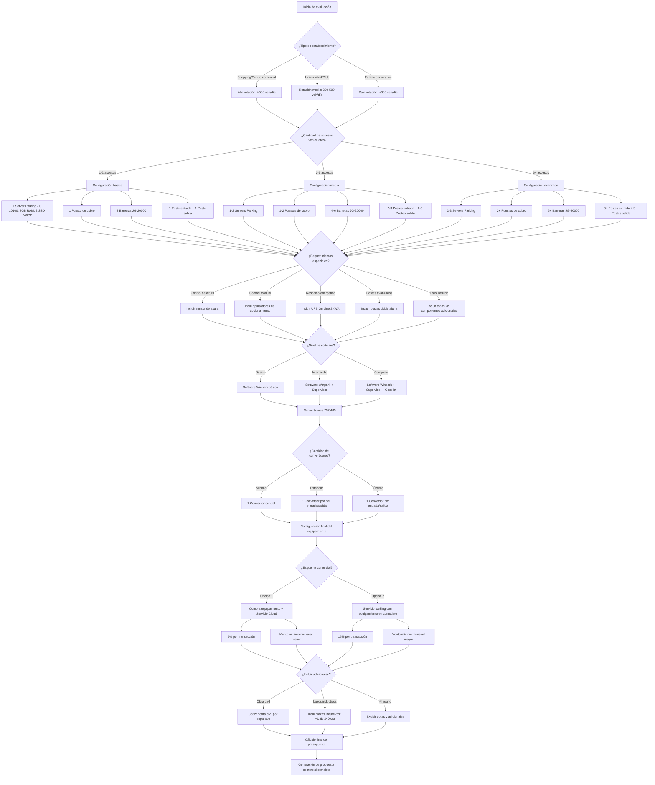

# Árbol de Decisiones Detallado para Elaboración de Presupuesto

Este diagrama muestra el flujo de decisiones que debe seguirse para determinar los componentes necesarios en un sistema de estacionamiento ParkingYa, basándose en las características del establecimiento y sus necesidades específicas.

## Cómo utilizar este diagrama

1. **Identificar el tipo de establecimiento** para determinar el volumen de rotación esperado
2. **Evaluar la cantidad de accesos** para seleccionar el nivel de configuración adecuado
3. **Determinar los componentes base** según la configuración (servidores, puestos de cobro, barreras, postes)
4. **Añadir requerimientos especiales** según las necesidades específicas
5. **Definir el nivel de software** requerido
6. **Dimensionar los componentes adicionales**
7. **Seleccionar el esquema comercial** más adecuado
8. **Evaluar consideraciones adicionales** como obra civil y componentes especiales
9. **Realizar el cálculo final** y generar la propuesta comercial
