# Proceso de Decisión para Esquema Comercial y Aspectos Financieros

Este diagrama muestra el proceso de toma de decisiones para determinar el esquema comercial y los aspectos financieros del presupuesto de sistemas de estacionamiento ParkingYa.

```mermaid
flowchart TD
    start[Análisis financiero] --> preferenciasCliente{¿Preferencias financieras del cliente?}
    
    preferenciasCliente -->|Inversión inicial baja| modeloServicio[Modelo de Servicio]
    preferenciasCliente -->|Control total del equipamiento| modeloCompra[Modelo de Compra]
    preferenciasCliente -->|Indeciso/Comparativa| ambosModelos[Presentar ambos modelos]
    
    %% Modelo de compra (Opción 1)
    modeloCompra --> opcion1[Opción 1: Compra Equipamiento + Servicio Cloud]
    opcion1 --> calculoEquipos[Cálculo del costo total de equipos]
    
    calculoEquipos --> itemsCompra[Items principales a presupuestar]
    itemsCompra --> serverP[Server Parking: ~U$D 990-2,105]
    itemsCompra --> puestoC[Puesto de Cobro: ~U$D 1,050-2,089 c/u]
    itemsCompra --> barrerasV[Barreras JG-20000: ~U$D 1,390-2,430 c/u]
    itemsCompra --> posteE[Postes Entrada: ~U$D 1,450-3,160 c/u]
    itemsCompra --> posteS[Postes Salida: ~U$D 1,200-3,160 c/u]
    itemsCompra --> conversor[Conversor 232/485: ~U$D 90-145 c/u]
    itemsCompra --> pulsador[Pulsador: ~U$D 40-65 c/u]
    itemsCompra --> ups[UPS: ~U$D 990-1,130]
    itemsCompra --> software[Software Winpark: ~U$D 615-900 c/u]
    itemsCompra --> instalacion[Instalación: ~U$D 640]
    
    %% Servicio Cloud para modelo de compra
    opcion1 --> servicioCloudCompra[Servicio Cloud]
    servicioCloudCompra --> porcentajeCompra[5% por transacción]
    porcentajeCompra --> minimoCompra[Monto mínimo mensual: $440,000-$700,000]
    
    %% Modelo de servicio (Opción 2)
    modeloServicio --> opcion2[Opción 2: Servicio Parking con Equipamiento en Comodato]
    opcion2 --> servicioCompleto[Servicio integral]
    servicioCompleto --> porcentajeServicio[15% por transacción]
    porcentajeServicio --> minimoServicio[Monto mínimo mensual: $800,000-$3,500,000]
    
    %% Equipos incluidos en Servicio
    servicioCompleto --> equiposIncluidos[Equipos incluidos en servicio]
    equiposIncluidos --> mismoEquipamiento[Mismo equipamiento que opción de compra]
    equiposIncluidos --> garantiaFull[Garantía durante todo el contrato]
    equiposIncluidos --> renovacion[Renovación cada 2 años]
    
    %% Comparativa de ambos modelos
    ambosModelos --> analisisComparativo[Análisis comparativo]
    
    analisisComparativo --> ventajasCompra[Ventajas Compra + Cloud]
    ventajasCompra --> inversionInicial[Alta inversión inicial]
    ventajasCompra --> menorCostoMensual[Menor costo mensual recurrente]
    ventajasCompra --> propiedadEquipo[Propiedad del equipamiento]
    ventajasCompra --> garantiaUnoAnio[Garantía por 1 año]
    
    analisisComparativo --> ventajasServicio[Ventajas Servicio Integral]
    ventajasServicio --> sinInversionInicial[Sin inversión inicial]
    ventajasServicio --> mayorCostoMensual[Mayor costo mensual recurrente]
    ventajasServicio --> renovacionAutomatica[Renovación automática cada 2 años]
    ventajasServicio --> mantenimientoIncluido[Mantenimiento incluido]
    
    %% Términos contractuales
    ventajasCompra & ventajasServicio --> terminosContractuales[Términos contractuales]
    
    terminosContractuales --> duracionContrato[Duración: 24 meses]
    terminosContractuales --> preaviso[Preaviso de cancelación: 30 días]
    terminosContractuales --> ajusteIPC[Ajuste de monto mínimo cada 3 meses según IPC]
    terminosContractuales --> exclusiones[Exclusiones: obra civil, tendido de ductos]
    
    %% Cálculo final
    duracionContrato & preaviso & ajusteIPC & exclusiones --> retornoInversion[Análisis ROI]
    
    retornoInversion --> volumenEstimado[Volumen estimado diario: ~300 vehículos]
    volumenEstimado --> ingresosTotales[Ingresos totales estimados]
    ingresosTotales --> costoTotal[Costo total estimado]
    
    %% Elección final y generación de presupuesto
    costoTotal --> recomendacionFinal[Recomendación de modelo de negocio]
    recomendacionFinal --> generacionPresupuesto[Generación del presupuesto final]
```

## Descripción de los esquemas comerciales

### Opción 1: Compra Equipamiento + Servicio Cloud

- **Descripción**: El cliente adquiere todo el equipamiento y paga un porcentaje menor por transacción más un monto mínimo mensual por el servicio cloud.
- **Inversión inicial**: Alta (costo total del equipamiento)
- **Costo operativo**: 5% por transacción
- **Monto mínimo mensual**: $440,000-$700,000 (según volumen estimado)
- **Garantía**: 1 año para el equipamiento
- **Mantenimiento**: No incluido después del período de garantía
- **Renovación tecnológica**: A cargo del cliente

### Opción 2: Servicio Parking con Equipamiento en Comodato

- **Descripción**: El cliente no adquiere el equipamiento, se entrega en comodato y paga un porcentaje mayor por transacción más un monto mínimo mensual.
- **Inversión inicial**: $0
- **Costo operativo**: 15% por transacción
- **Monto mínimo mensual**: $800,000-$3,500,000 (según volumen estimado)
- **Garantía**: Durante toda la duración del contrato
- **Mantenimiento**: Incluido durante toda la vigencia del contrato
- **Renovación tecnológica**: Cada 2 años

## Términos contractuales comunes

- **Duración del contrato**: 24 meses
- **Preaviso de cancelación**: 30 días para ambas partes
- **Ajuste del monto mínimo**: Cada 3 meses según IPC
- **Exclusiones**: Obras civiles y tendido de ductos
- **Instalación**: Puede incluirse en el presupuesto o cotizarse por separado
- **Lazos inductivos**: Se cotizan por separado (aprox. U$D 240 + IVA por lazo)

## Análisis de ROI

Para ayudar al cliente a tomar una decisión informada, se debe realizar un análisis comparativo del retorno de inversión:

1. **Estimar el volumen diario** de vehículos (comúnmente alrededor de 300)
2. **Calcular el ingreso total estimado** por mes
3. **Comparar los costos totales** de ambas opciones en diferentes horizontes temporales:
   - A 6 meses
   - A 12 meses
   - A 24 meses
   - A 36 meses
4. **Recomendar la opción** más conveniente según el perfil del cliente
