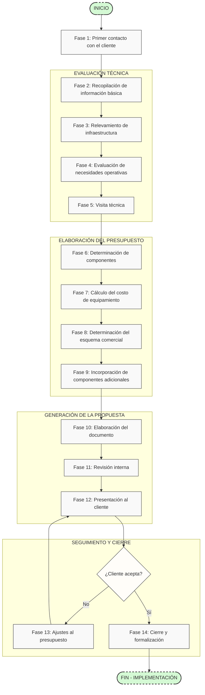

# Flujo Visual del Proceso de Presupuestación

El siguiente diagrama muestra el flujo completo del proceso de presupuestación para sistemas de estacionamiento ParkingYa:

## Descripción de las fases

### Preparación inicial
- **Fase 1**: Primer contacto con el cliente
- **Fase 2**: Recopilación de información básica

### Evaluación técnica
- **Fase 3**: Relevamiento de infraestructura
- **Fase 4**: Evaluación de necesidades operativas
- **Fase 5**: Visita técnica (opcional pero recomendada)

### Elaboración del presupuesto
- **Fase 6**: Determinación de componentes necesarios
- **Fase 7**: Cálculo del costo de equipamiento
- **Fase 8**: Determinación del esquema comercial
- **Fase 9**: Incorporación de componentes adicionales

### Generación de la propuesta
- **Fase 10**: Elaboración del documento de presupuesto
- **Fase 11**: Revisión interna
- **Fase 12**: Presentación al cliente

### Seguimiento y cierre
- **Fase 13**: Ajustes al presupuesto (si es necesario)
- **Fase 14**: Cierre y formalización
