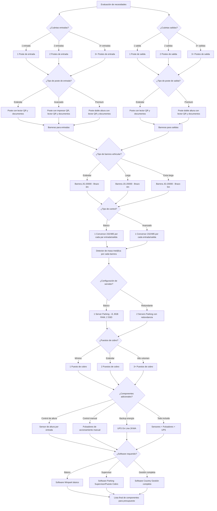

# Selección de Componentes para Sistema de Estacionamiento

Este diagrama muestra el proceso detallado para seleccionar los componentes específicos que deben incluirse en un sistema de estacionamiento ParkingYa, basándose en la configuración de entradas y salidas, así como en requerimientos especiales.

## Componentes y sus características

### Postes de entrada
- **Estándar**: Poste con lector QR y documentos (MicroPDF) - ~$1,200-1,450 USD
- **Avanzado**: Poste con impresor QR, lector QR y documentos - ~$1,450-1,667 USD
- **Premium**: Poste doble altura con lector QR y documentos - ~$6,315 USD

### Postes de salida
- **Estándar**: Poste con lector QR y documentos - ~$1,050-1,598 USD
- **Premium**: Poste doble altura con lector QR y documentos - ~$6,315 USD

### Barreras vehiculares JG-20000
- **Estándar**: Brazo de 3 metros - ~$1,390-2,430 USD
- **Características**: 20,000 ciclos/día, apertura 1.8-2.5 segundos, IP55, motor 1/6 HP

### Conversores y detectores
- **Conversor 232/485**: ~$90-145 USD cada uno
- **Detector de masa metálica**: Incluido con cada barrera

### Servidores y puestos de cobro
- **Server Parking**: ~$990-2,105 USD (CPU i3, 8GB RAM, 2 SSD 240GB)
- **Puesto de cobro**: ~$1,050-2,089 USD (CPU i3, 8GB RAM, 1 SSD 240GB, lector QR/MicroPDF)

### Componentes adicionales
- **Sensor de altura**: ~$690 USD
- **Pulsador de accionamiento manual**: ~$40-65 USD
- **UPS On Line 2KWA**: ~$990-1,130 USD

### Software y licencias
- **Software Winpark básico**: ~$615-900 USD
- **Software Supervisor/Puesto Cobro**: ~$810 USD
- **Software Country Gestión**: ~$615 USD

## Instrucciones de uso

1. **Iniciar con la evaluación de entradas y salidas** para determinar la cantidad de postes necesarios
2. **Seleccionar el tipo de postes** según los requerimientos específicos
3. **Determinar las barreras** adecuadas para cada entrada/salida
4. **Configurar el control** con los conversores necesarios
5. **Dimensionar los servidores y puestos de cobro** según el volumen esperado
6. **Añadir componentes adicionales** según necesidades específicas
7. **Seleccionar el software** más adecuado
8. **Generar la lista final** de componentes para el presupuesto
